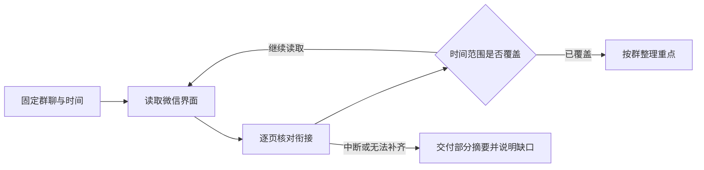

<div align="center">

# WeChat Overlord

### 群消息太多？让 Codex 帮你读。

面向 Windows 微信的 AI 技能集合。通过真实界面，完成聊天阅读与整理。


[技能目录](#技能目录) · [开始使用](#开始使用) · [工作方式](#工作方式) · [后续计划](#后续计划)

</div>

---

> “帮我总结折叠聊天里前两个群过去一天的内容，重点看招聘机会和需要我处理的事。”

打开微信，固定目标群和时间范围，逐页核对聊天记录，再按群整理重点。遇到消息未加载、图片看不清或操作中断，会明确说明已读范围。

## 技能目录

| 技能 | 能做什么 | 状态 |
| --- | --- | --- |
| [wechat-daily-summary](skills/wechat-daily-summary/SKILL.md) | 总结指定群或折叠聊天过去一天的消息，也支持指定时间范围 | 可用，持续验证中 |
| `wechat-reply-new-messages` | 阅读新消息上下文、拟定回复，并按用户授权处理发送 | 规划中 |

每个技能独立存放在 `skills/` 下。按需安装，后续新增技能不会改变已有技能的职责。

## 开始使用

### 准备环境

- Windows 电脑，已登录的桌面微信。
- 能运行技能的 Codex 环境。
- 已安装且可调用的 Computer Use 插件。该插件提供窗口选择、截图和键鼠操作能力，本仓库提供任务流程。

### 安装每日总结技能

将仓库中的 `skills/wechat-daily-summary` 文件夹复制到 Codex 的技能目录。默认路径为 `%USERPROFILE%\.codex\skills`；设置了 `CODEX_HOME` 时使用其下的 `skills` 目录。

也可以在 PowerShell 执行以下命令。克隆目录 `WeChat-Overlord` 需尚不存在，目标技能目录存在时命令会停止，避免覆盖已有修改。

```powershell
git clone https://github.com/youngbeauty/WeChat-Overlord.git
if ($LASTEXITCODE -ne 0) { throw '仓库克隆失败' }

$skillRoot = if ($env:CODEX_HOME) {
    Join-Path $env:CODEX_HOME 'skills'
} else {
    Join-Path $env:USERPROFILE '.codex\skills'
}
$skillTarget = Join-Path $skillRoot 'wechat-daily-summary'
if (Test-Path -LiteralPath $skillTarget) { throw '技能目录已存在，请先检查已有版本' }
New-Item -ItemType Directory -Path $skillRoot -Force | Out-Null
Copy-Item -LiteralPath '.\WeChat-Overlord\skills\wechat-daily-summary' -Destination $skillTarget -Recurse
```

### 直接交代任务

```text
使用 $wechat-daily-summary，帮我总结折叠聊天前两个群过去 24 小时的消息。
```

```text
使用 $wechat-daily-summary，总结“产品讨论群”昨天的聊天。
重点列出已经确定的事项、截止时间和需要我回复的问题。
```

“过去一天”默认回溯 24 小时，“昨天”按自然日处理。技能会在开始时固定时间终点，阅读过程中出现的新消息不会无限延长任务。

## 工作方式



### 把容易出错的地方写进流程

| 界面问题 | 技能如何处理 |
| --- | --- |
| 新消息让折叠群顺序变化 | 按第一次看到的列表固定目标，进群核对名称 |
| 窗口被遮挡、只能读到空窗格 | 激活微信，检查布局，改用截图阅读 |
| 滚轮位移太小 | 检查聊天区焦点，尝试 Page Up 并验证结果 |
| 历史消息加载后页面跳动 | 等布局稳定，以相邻页消息核对是否漏读 |
| 翻了很多页，却无法证明读完 | 找到时间起点之前的边界，并检查中间缺口 |
| 用户按下 Esc | 立即停止操作，交付已读部分 |

摘要优先提取具体机会、决定、时间和行动事项。闲聊简述，群友观点保留来源，未打开的文章和附件不会被当作已读内容。

## 使用边界

当前技能读取并总结聊天，不发送消息。它依赖界面中可见、可加载的记录，不包含聊天数据库解密或微信协议接入。

截图阅读的速度取决于消息量和界面加载情况，微信更新也可能影响操作。模糊图片、未读取的语音或附件会形成明确标注的内容缺口。

执行期间，聊天截图与读取内容会进入所用 AI 工具的处理流程。本仓库仅保存技能说明，请勿把真实聊天记录、截图或个人信息提交到仓库。

## 后续计划

- [x] 每日群聊总结，支持折叠聊天与时间范围核对。
- [ ] 新消息回复技能，区分草拟回复和实际发送。

## 添加新技能

```text
WeChat-Overlord/
├── README.md
└── skills/
    └── wechat-daily-summary/
        └── SKILL.md
```

新增技能时创建独立目录，在 `SKILL.md` 中写明触发场景、操作流程、完成标准与中断处理，并更新上方技能目录。避免写死窗口坐标、群名或插件版本路径。

欢迎通过 [Issues](https://github.com/youngbeauty/WeChat-Overlord/issues) 反馈操作卡点。描述微信版本、操作步骤和实际结果即可；截图请先遮住私人信息。
